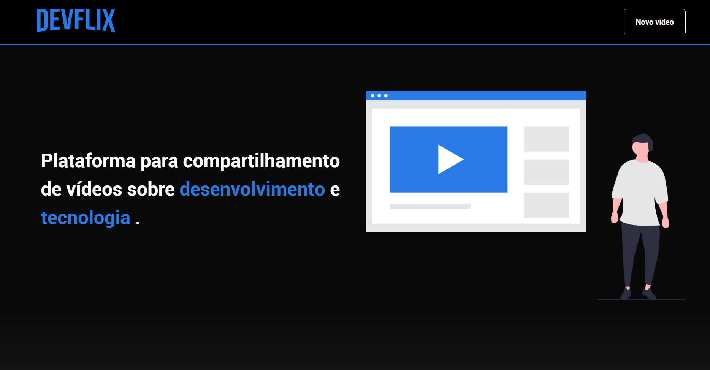

<h3 align="center">
    
    <br>
</h3>
<p align="center"> 🚀 <strong>DevFlix</strong> Aplicação desenvolvida com base na Imersão React da Alura.
 </p>

<p align="center">
  <a href="https://opensource.org/licenses/MIT">
    
  </a>
</p>

# Índice

- [Sobre](#sobre)
- [Tecnologias Utilizadas](#tecnologias-utilizadas)
- [Como Usar](#como-usar)
- [Como Contribuir](#como-contribuir)

<a id="sobre"></a>

## :bookmark: Sobre

O <strong>Devflix</strong> é uma aplicação web para o compartilhamento de vídeos sobre desenvolvimento e tecnologia em que é possível cadastrar novos vídeos e categorias.

## :rocket: Tecnologias Utilizadas

O projeto foi desenvolvido utilizando as seguintes tecnologias

- [ReactJS](https://reactjs.org/)
- [Styled Components](https://styled-components.com//)

## :heavy_check_mark: Resultado:

<h3 align="center">

</h3>

## :fire: Como utilizar

### :exclamation: Instalação - Front-End (Aplicação Web)
Para iniciar o **Frontend** do React utilize os comandos:
```bash
yarn install // npm install
yarn start // npm start
```
Assim que o processo terminar, automaticamente será aberta no seu navegador a página `localhost:3000` contendo o projeto desenvolvido.

## :recycle: Como contribuir
- Primeiro, deixe uma ⭐ se você gostou!
- Faça um Fork desse repositório;
- Crie uma branch com a sua feature: `git checkout -b my-feature`
- Commit suas mudanças: `git commit -m 'feat: My new feature'`
- Push a sua branch: `git push origin my-feature`

## :memo: License

Esse projeto está sob a licença MIT. Veja o arquivo [LICENSE](LICENSE.md) para mais detalhes.

---

<h4 align="center">
    Feito com 💜 por <a href="https://www.linkedin.com/in/guilherme-orcezi" target="_blank">Guilherme Orcezi</a>
</h4>
